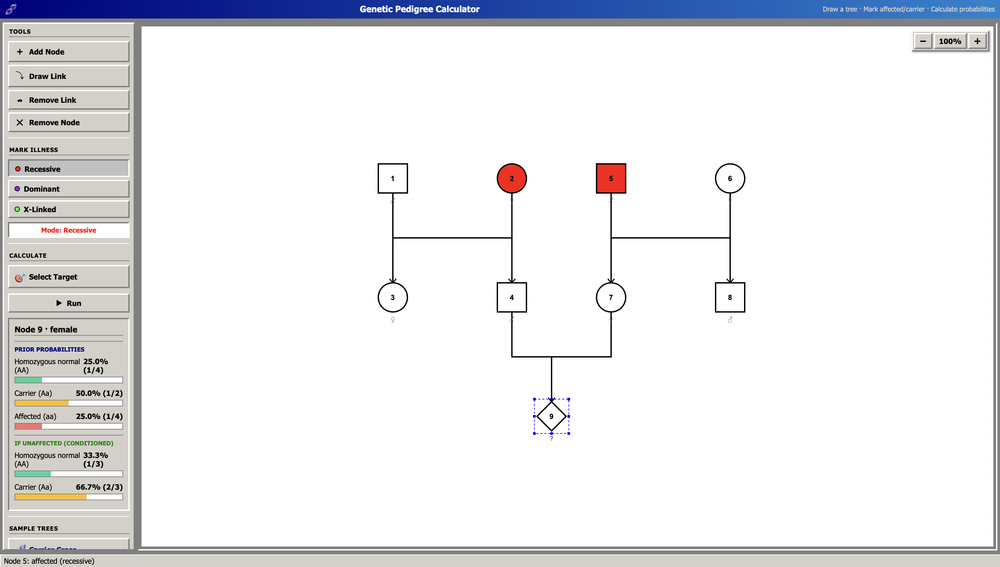
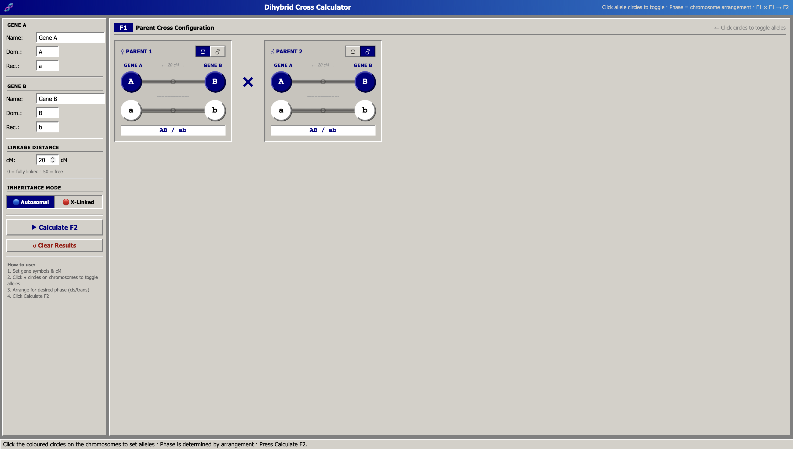
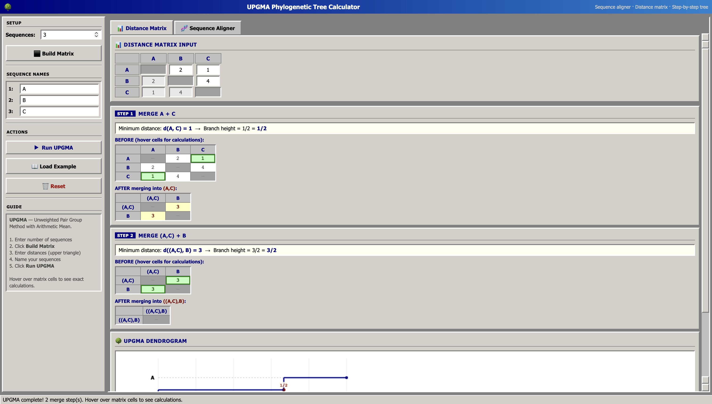
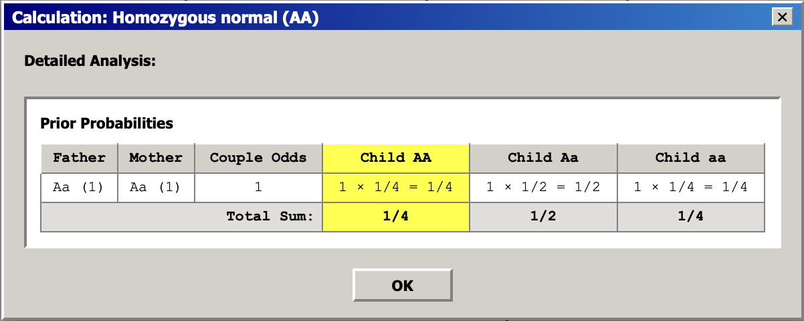

# ISV-tools

Bienvenue sur cet ensemble d'outils conçu pour le cours BIO-109 (Introduction à la science de la vie) de l'EPFL. Ces calculateurs ont été créés pour faciliter la résolution de problèmes complexes en biologie.

Welcome to the ISV-tools repository! This suite of tools was specifically made for the course BIO-109 (Introduction to Life Sciences) at EPFL. 

As of 2026, large language models (LLMs) still struggle with complex algorithmic biology problems due to context shortfalls and hallucination. These tools are designed to do what LLMs currently cannot: provide accurate, reliable, and step-by-step calculations for specific biological models without hallucinating results.

## Available Calculators [Calculateurs Disponibles]

### 1. Genetic Pedigree Calculator [Calculateur de Pédigrée Génétique]
- **File [Fichier]**: `tree_calc.html`
- Moderate testing on different sizes of trees has not shown any error. 
- The detailed calculations [calculs détaillés] provided by the tool are meant for reference and to help you understand the steps.

### 2. Dihybrid Cross Calculator [Calculateur de Croisement Dihybride]
- **File [Fichier]**: `dihybrid_cross_calc.html`
- Helps analyze genetic inheritance across two linked genes [gènes liés], including autosomal [autosomique] and X-linked [lié à l'X] modes.

### 3. UPGMA Phylogenetic Tree Calculator [Calculateur d'Arbre Phylogénétique UPGMA]
- **File [Fichier]**: `upgma_calc.html`
- Sequence aligner and distance matrix [matrice de distance] generator. Provides a step-by-step UPGMA tree [arbre UPGMA] with intermediate calculations.

### 4. Genomic Sequence & PCR Analyzer [Analyseur de Séquence Génomique et PCR]
- **File [Fichier]**: `genomic_seq_calc.html`
- Translates sequences [séquences], predicts point mutation [mutation ponctuelle] effects, and outputs theoretical PCR primers [amorces PCR].

## Getting Started [Pour Commencer]
You can run these tools either online at [sixela06.github.io/ISV-tools](https://sixela06.github.io/ISV-tools) (also accessible via [sixela06.github.com/ISV-tools](https://sixela06.github.com/ISV-tools)) or offline by opening the local HTML files (starting with `index.html`) directly in your web browser. No installation or server is required.
